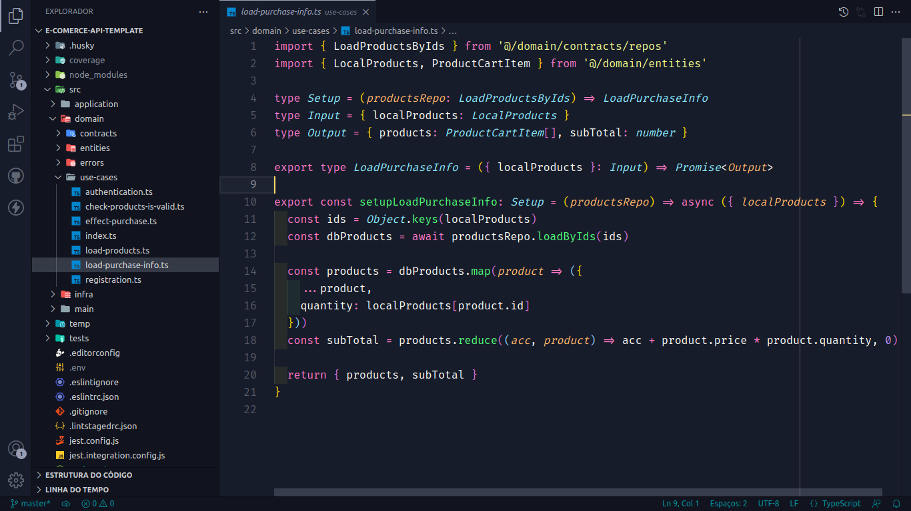

> # API para E-comerce feita com node js

[]

## Principios
* ### SOLID
* ### YAGNI
* ### DRY
* ### KISS

## Libs e Frameworks

* ### Typescript
* ### Jest
* ### Ts-jest
* ### Jest-mock-extended
* ### Axios
* ### Postgres
* ### Cors
* ### Lint-staged
* ### Husky
* ### Eslint
* ### Module-alias
* ### Express
* ### Git
